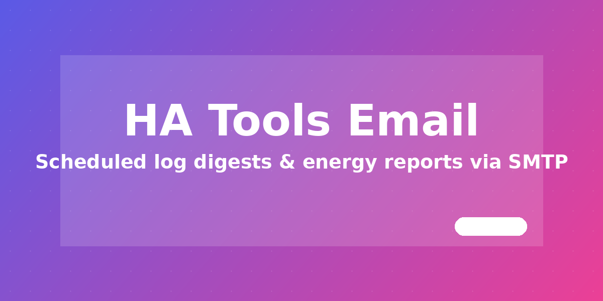

# HA Tools Email



Built-in SMTP integration for Home Assistant. It is used by HA Tools email cards and can also send scheduled server-side log and energy reports.

[](https://www.home-assistant.io/) [](LICENSE) [](https://github.com/MacSiem/ha-tools-email-integration/releases)

## What It Provides

The integration keeps the original five services for existing HA Tools cards:

| Service | Purpose |
|---|---|
| `ha_tools_email.send` | Send an email to one or many recipients with plain text and optional HTML. |
| `ha_tools_email.test` | Send a test message to verify SMTP settings. |
| `ha_tools_email.save_config` | Persist SMTP server, port, credentials, sender, encryption, and default recipient. |
| `ha_tools_email.get_config` | Return current SMTP settings for existing cards. The password is masked or returned as its `!secret` reference. |
| `ha_tools_email.list_secrets` | Return available `secrets.yaml` key names only. Secret values are never returned. |

Configuration is stored in `<config>/ha-tools/smtp-config.json`. The password can be a literal value or an `!secret <key>` reference resolved from `secrets.yaml` at send time.

Version 2.0.0 also adds:

- Store-backed schedules for `log_digest` and `energy_report`.
- Server-side log digest composition from Home Assistant `system_log`.
- Server-side energy reports from recorder statistics for discovered energy sensors.
- A websocket API for schedule management and immediate report sending.

## Installation

### HACS Custom Repository

1. Open HACS.
2. Open **Custom repositories**.
3. Add `https://github.com/MacSiem/ha-tools-email-integration` with category **Integration**.
4. Install **HA Tools Email**.
5. Restart Home Assistant.
6. Go to **Settings -> Devices & services -> Add integration** and add **HA Tools Email**.

The config flow is zero-input. SMTP details are still saved through the existing HA Tools card UI or by calling `ha_tools_email.save_config`.

### Manual

1. Copy `custom_components/ha_tools_email/` to `<config>/custom_components/`.
2. Restart Home Assistant.
3. Add **HA Tools Email** from **Settings -> Devices & services**.

## SMTP Configuration

Call `ha_tools_email.save_config` from Developer Tools or use the HA Tools Email card:

```yaml
service: ha_tools_email.save_config
data:
  server: smtp.example.com
  port: 587
  username: user@example.com
  password: "!secret smtp_app_password"
  sender: user@example.com
  encryption: starttls
  default_recipient: recipient@example.com
```

Send an email manually:

```yaml
service: ha_tools_email.send
data:
  to: "user@example.com"
  subject: "HA Tools report"
  body: "Plain-text body."
  html: "<h2>Optional HTML body</h2>"
```

## Scheduler

Schedules are stored with Home Assistant `Store`, not YAML:

```json
{
  "kind": "log_digest",
  "cadence": "daily",
  "time": "07:30",
  "recipients": ["user@example.com"],
  "enabled": true
}
```

Supported `kind` values:

- `log_digest`
- `energy_report`

Supported `cadence` values:

- `daily` - every day at `time`
- `weekly` - Monday at `time`
- `monthly` - first day of the month at `time`

If `recipients` is empty, the scheduler uses `default_recipient` from SMTP config.

## Server-Side Reports

Log digests read Home Assistant `system_log` records, aggregate counts by level and logger, deduplicate from the last digest state, and include the top recent errors and warnings.

Energy reports auto-discover `sensor.*` entities with `device_class: energy` or kWh/Wh energy units, then use recorder `statistics_during_period` changes for the selected period. Reports include total kWh and a top-consumers table.

## Websocket API

All commands use the integration domain prefix.

Read non-secret config and schedules:

```json
{ "type": "ha_tools_email/get_config" }
```

List schedules:

```json
{ "type": "ha_tools_email/list_schedules" }
```

Create or update a schedule. Admin required:

```json
{
  "type": "ha_tools_email/set_schedule",
  "action": "upsert",
  "schedule": {
    "kind": "energy_report",
    "cadence": "weekly",
    "time": "08:00",
    "recipients": ["user@example.com"],
    "enabled": true
  }
}
```

Delete a schedule. Admin required:

```json
{
  "type": "ha_tools_email/set_schedule",
  "action": "delete",
  "schedule_id": "schedule-id"
}
```

Compose and send immediately. Admin required:

```json
{
  "type": "ha_tools_email/send_now",
  "kind": "log_digest",
  "cadence": "daily",
  "recipients": ["user@example.com"]
}
```

The websocket config response never returns the SMTP password.

## Privacy And Security

- SMTP credentials stay on the Home Assistant instance.
- Websocket mutations require an admin connection.
- Secret values from `secrets.yaml` are never listed or returned.
- The integration sends email only through the SMTP server you configure.

## Supported HA Tools Cards

- `ha-energy-email`
- `ha-log-email`

Existing cards can continue using the original service calls.

## License

MIT - see [LICENSE](LICENSE).
